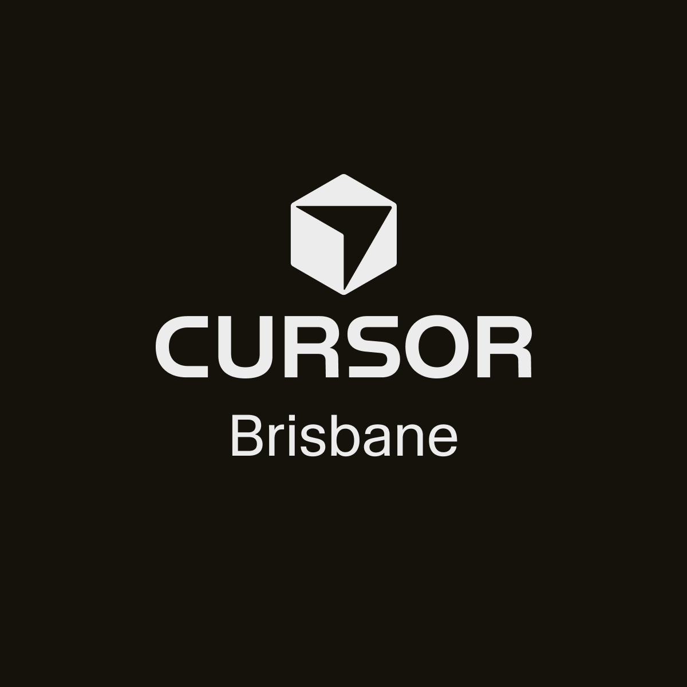

  
  

    
Cursor Community

    <h1 class="text-5xl md:text-7xl font-black leading-tight tracking-tight">Cursor Workshop Brisbane</h1>
    
Hands-on build sprint for devs, founders, and builders

    
The Precinct · Fortitude Valley, QLD

  

---
layout: default
class: bg-[#0F0F0F] text-white
---

# What this workshop is

  Brisbane's first Cursor workshop: quick practical tips, then a guided sprint where everyone builds a small web app from scratch.

  Built for mixed experience levels. Basic JavaScript/web familiarity helps, but the flow is designed to be beginner-friendly and practical.

---
layout: default
class: bg-[#0F0F0F] text-white
---

# Event essentials

  

    
Presented by

    
Cursor Community

  

  

    
Hosted by

    
Nathan Chung

  

  

    
Status

    
Event Full

    
Join waitlist for open spots

  

  

    
Location

    
The Precinct, Level 3 315 Brunswick St, Fortitude Valley QLD

  

---
layout: default
class: bg-[#0F0F0F] text-white
---

# Who this is for

  

    You already use Cursor and want stronger workflows.
  

  

    You are new to Cursor and want a fast, practical intro.
  

  

    You want to meet local builders and ship something in one evening.
  

---
layout: default
class: bg-[#0F0F0F] text-white
---

# What to bring and setup

  

    
Required

    <ul class="space-y-2 text-white/90">
      <li>• Laptop + charger</li>
      <li>• Cursor installed + signed in</li>
      <li>• Node.js installed</li>
      <li>• Modern browser (Chrome or similar)</li>
    </ul>
  

  

    
Optional

    <ul class="space-y-2 text-white/90">
      <li>• Git installed</li>
      <li>• GitHub + Vercel for optional deploy</li>
    </ul>
    

      Setup help available before workshop.
    

  

---
layout: default
class: bg-[#0F0F0F] text-white
---

# Agenda

  <table class="w-full text-left border-collapse">
    <thead>
      <tr class="text-white/70 text-sm uppercase tracking-[0.15em]">
        <th class="p-3">Time</th>
        <th class="p-3">Session</th>
      </tr>
    </thead>
    <tbody class="text-white/90">
      <tr class="border-t border-[#252525]"><td class="p-3">5:00 pm</td><td class="p-3">Arrive, food, networking</td></tr>
      <tr class="border-t border-[#252525]"><td class="p-3">5:15 pm</td><td class="p-3">Welcome</td></tr>
      <tr class="border-t border-[#252525]"><td class="p-3">5:20–5:30 pm</td><td class="p-3">3 quick Cursor tips from speakers</td></tr>
      <tr class="border-t border-[#252525]"><td class="p-3">5:40 pm</td><td class="p-3">Responsible AI Australia segment</td></tr>
      <tr class="border-t border-[#252525]"><td class="p-3">5:50 pm</td><td class="p-3">Sprint briefing</td></tr>
      <tr class="border-t border-[#252525]"><td class="p-3">6:00 pm</td><td class="p-3">Build sprint</td></tr>
      <tr class="border-t border-[#252525]"><td class="p-3">6:50 pm</td><td class="p-3">Lightning demos</td></tr>
      <tr class="border-t border-[#252525]"><td class="p-3">7:00 pm</td><td class="p-3">Wrap</td></tr>
    </tbody>
  </table>

---
layout: default
class: bg-[#0F0F0F] text-white
---

# Build sprint focus

  

    <h3 class="text-xl font-semibold mb-3">Sprint goal</h3>
    

      Build and demo a small web app from scratch in one guided session.
    

  

  

    <h3 class="text-xl font-semibold mb-3">Support</h3>
    

      Practical guidance during the sprint, with room support across all skill levels.
    

  

  Sponsored by <strong class="text-white">Responsible AI Australia</strong> (safe and responsible use of AI coding tools).

---
layout: center
class: bg-[#0F0F0F] text-white text-center
---

  
  <h2 class="text-4xl font-black tracking-tight">Join the waitlist</h2>
  
Registration is currently full.

  <a class="text-white underline decoration-white/40 underline-offset-4 hover:decoration-white" href="https://luma.com/4y41mt4x">
    luma.com/4y41mt4x
  </a>
  
Cursor Community · Brisbane

